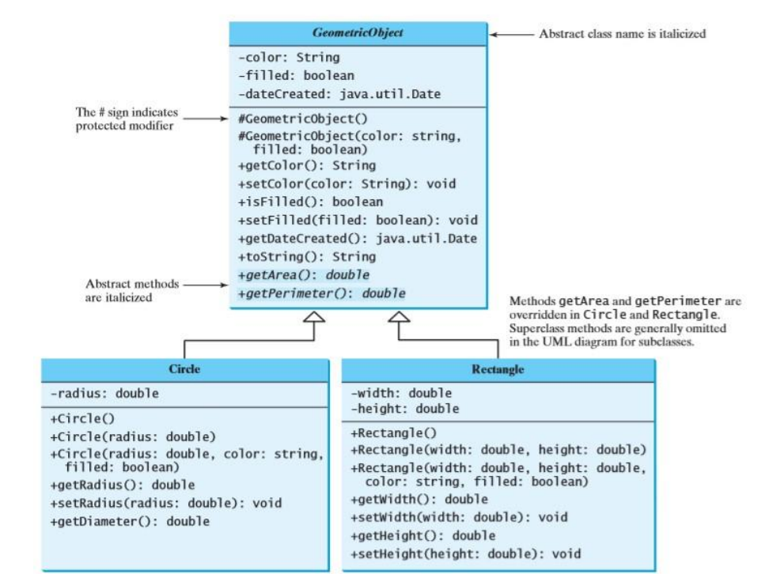

#Abstraction of class

##Geometric Object

Create an abstract class GeometricObject as the superclass for Circle and 
Rectangle. GeometricObject models common features of geometric objects. Both
Circle and Rectangle contain the getArea() and getPerimeter() methods for
computing the area and perimeter of a circle and a rectangle. 

Since you can
compute areas and perimeters for all geometric objects, so define the getArea() and
getPerimeter() methods in the GeometricObject class. 

Give implementation in the specific type of geometric object. 
Create TestGeometricObject class to display area
and perimeter of Rectangle and Triangle, compare area of both and display results.
Design of all classes are given in the following UML diagram.

