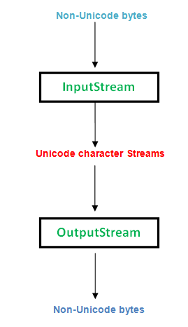

#Character Stream V/S Byte Stream

--------
- Stream: A sequence of data.

- Input Stream: reads data from source.

- Output Stream: writes data to destination.

_____________

Character Stream

Character stream automatically allows us to read/write data 
character by character. 

For example FileReader and FileWriter are character streams used
to read from source and write to destination.

 
_____________

Byte Stream

Byte streams process data byte by byte (8 bits). 
For example FileInputStream is used to read 
from source and FileOutputStream to write to the destination.

---------------
##When to use what

---------
1. In Java, characters are stored using Unicode conventions. 
Character stream is useful when we want to process text files. 
These text files can be processed character by character. 
A character size is typically 16 bits.
2. Byte oriented reads byte by byte.
A byte stream is suitable for processing raw data like binary files.

