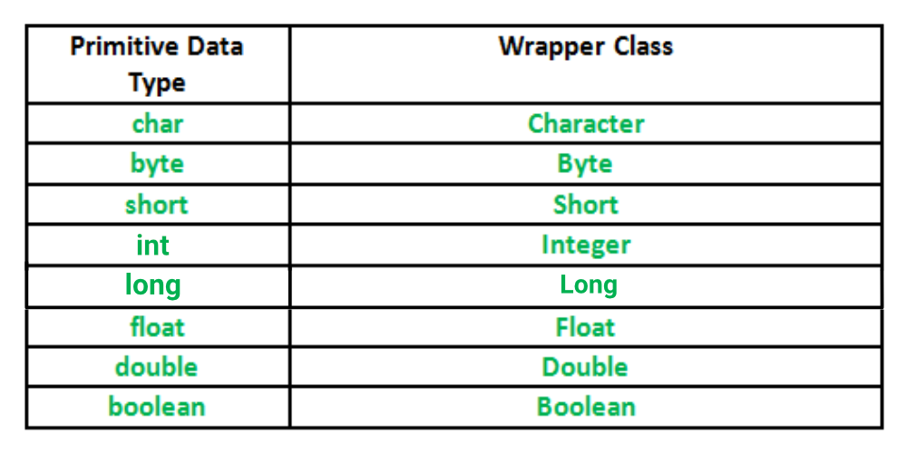
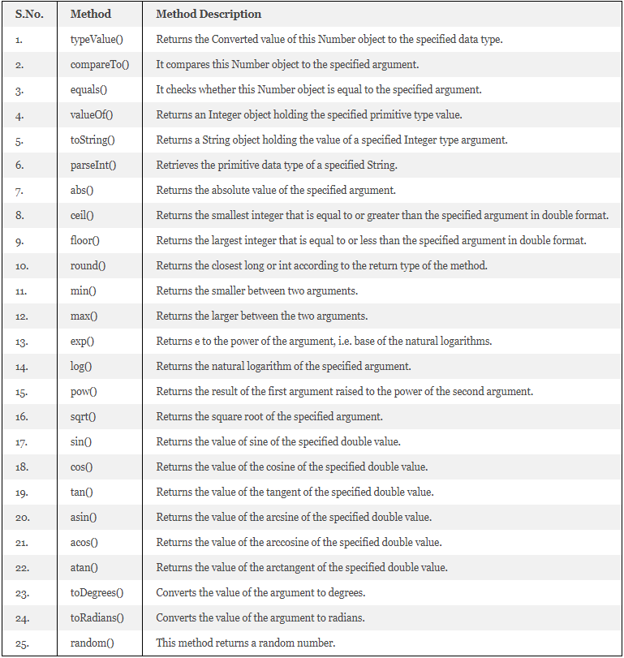

#WAP to demonstrate methods of wrapper class.

---------
<p>
A Wrapper class is a class whose object wraps or contains primitive data types. 
When we create an object to a wrapper class, it contains a field and in this field, 
we can store primitive data types. In other words, 
we can wrap a primitive value into a wrapper class object.
</p>

##Need of wrapper Classes
1. They convert primitive data types into objects. Objects are needed if we wish to modify the arguments passed into a method
2. The classes in java.util package handles only objects and hence wrapper classes help in this case also.
3. Data structures in the Collection framework, such as ArrayList and Vector, store only objects (reference types) and not primitive types.
4. An object is needed to support synchronization in multithreading.




-------
###Autoboxing: 

Automatic conversion of primitive types to the object of their corresponding
wrapper classes is known as autoboxing. 

For example – conversion of int to Integer, long to Long, double to Double etc.
```java
// Autoboxing- primitive to Character object conversion
   Character a = ch;
```

###Unboxing
It is just the reverse process of autoboxing. 
Automatically converting an object of a wrapper class to its corresponding primitive type is known as
unboxing. 

For example – conversion of Integer to int, Long to long, Double to double, etc.

```java
Character ch = 'a';
// unboxing - Character object to primitive conversion
char a = ch;
```

